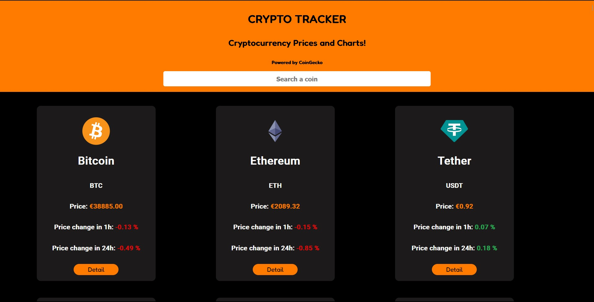

# Crypto Tracker Project

This web application allows you to track the latest prices and details of various cryptocurrencies effortlessly. Leveraging the CoinGecko API for real-time cryptocurrency data, React for the front end, and React Router for seamless navigation, this project aims to provide a user-friendly and informative experience.

### 2024 January Update
Because of the CoinGecko request limit, I have to change the code to adapt to the new limits and reduce the request number so the app doesn't crash.

## [Crypto Tracker](https://goofy-carson-b7a87d.netlify.app/)

## Technologies Used

Cryptocurrency Data:
- CoinGecko API

Frontend:
- React
- React Router

Data Fetching:
- Axios

## Project Overview

### CoinGecko API Integration

The CoinGecko API is used to fetch and serve real-time cryptocurrency data. This ensures the price tracker is always up-to-date with the latest information on a wide range of cryptocurrencies.

### Frontend with React

The front end is developed using React, offering a dynamic and responsive user interface. Users can easily view and search for cryptocurrency details, making it a convenient tool for staying informed about the crypto market. React Router is for facilitating smooth navigation between different views. This enhances the user experience by allowing seamless transitions between pages, making it easy to explore various cryptocurrency details.

### Data Fetching with Axios

Axios fetches data from the CoinGecko API, providing a simple and efficient way to make HTTP requests. This ensures that cryptocurrency data is retrieved and displayed in real time, contributing to the dynamic nature of the price tracker.

### Visualization with ChartJS

ChartJS is integrated into the project to visualize cryptocurrency trends and historical data. This feature allows users to gain insights into the performance of various cryptocurrencies over time, enhancing the analytical capabilities of the price tracker.

# Getting Started with Create React App

This project was bootstrapped with [Create React App](https://github.com/facebook/create-react-app).

## Available Scripts

In the project directory, you can run:

### `npm start`

Runs the app in the development mode.\
Open [http://localhost:3000](http://localhost:3000) to view it in your browser.

The page will reload when you make changes.\
You may also see any lint errors in the console.

### `npm test`

Launches the test runner in the interactive watch mode.\
See the section about [running tests](https://facebook.github.io/create-react-app/docs/running-tests) for more information.

### `npm run build`

Builds the app for production to the `build` folder.\
It correctly bundles React in production mode and optimizes the build for the best performance.

The build is minified and the filenames include the hashes.\
Your app is ready to be deployed!

See the section about [deployment](https://facebook.github.io/create-react-app/docs/deployment) for more information.

### `npm run eject`

**Note: this is a one-way operation. Once you `eject`, you can't go back!**

If you aren't satisfied with the build tool and configuration choices, you can `eject` at any time. This command will remove the single build dependency from your project.

Instead, it will copy all the configuration files and the transitive dependencies (webpack, Babel, ESLint, etc) right into your project so you have full control over them. All of the commands except `eject` will still work, but they will point to the copied scripts so you can tweak them. At this point you're on your own.

You don't have to ever use `eject`. The curated feature set is suitable for small and middle deployments, and you shouldn't feel obligated to use this feature. However we understand that this tool wouldn't be useful if you couldn't customize it when you are ready for it.

## Learn More

You can learn more in the [Create React App documentation](https://facebook.github.io/create-react-app/docs/getting-started).

To learn React, check out the [React documentation](https://reactjs.org/).

### Code Splitting

This section has moved here: [https://facebook.github.io/create-react-app/docs/code-splitting](https://facebook.github.io/create-react-app/docs/code-splitting)

### Analyzing the Bundle Size

This section has moved here: [https://facebook.github.io/create-react-app/docs/analyzing-the-bundle-size](https://facebook.github.io/create-react-app/docs/analyzing-the-bundle-size)

### Making a Progressive Web App

This section has moved here: [https://facebook.github.io/create-react-app/docs/making-a-progressive-web-app](https://facebook.github.io/create-react-app/docs/making-a-progressive-web-app)

### Advanced Configuration

This section has moved here: [https://facebook.github.io/create-react-app/docs/advanced-configuration](https://facebook.github.io/create-react-app/docs/advanced-configuration)

### Deployment

This section has moved here: [https://facebook.github.io/create-react-app/docs/deployment](https://facebook.github.io/create-react-app/docs/deployment)

### `npm run build` fails to minify

This section has moved here: [https://facebook.github.io/create-react-app/docs/troubleshooting#npm-run-build-fails-to-minify](https://facebook.github.io/create-react-app/docs/troubleshooting#npm-run-build-fails-to-minify)
